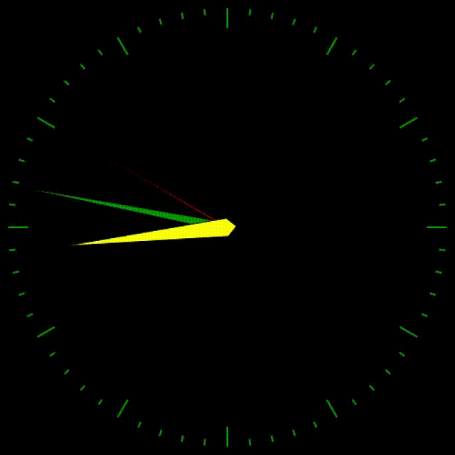

# Color Box
**Color Box** is a colorful analog clock,<br/>
with 64 colors and _microsecond_ accuracy <br/>

__A Clock without TIK-TAK__

<div dir="rtl">
جعبه رنگ، یک ساعت آنالوگ رنگارنگ،<br/>
با 64 رنگ و دقت
_میکروثانیه_

<br/>

__یک ساعت بدون تیک-تاک__
</div>

<br/>



## Table of contents
* [Support](#support)
* [Licence](#Licence)
* [Technologies](#technologies)
* [Setup Windows](#setup-windows)
* [Setup Linux](#setup-linux)
* [Usage](#usage)
* [Note](#note)

___
## Support
If you used this project or learned something please give this project a star to keep doing open source projects

___
## License
Copyright &copy; 2021+ All rights reserved.

___
## Technologies
Project is created with:
* colorama==0.4.4
* loguru==0.5.3
* notify-py==0.3.3
* pygame==2.1.2
* win32-setctime==1.0.4

___
## Setup Windows
Open CMD or PowerShell in the folder and type:
```
> virtualenv env
> \env\Scripts\activate.bat
> pip install -r requeriments.txt
> python src\ColorBox.py
```
___
## Setup Linux
To be able to run it you have to open the terminal in the folder and type:
```
$ virtualenv env
$ source env/bin/activate
$ pip3 install -r requeriments.txt
$ python3 src/ColorBox.py
```
___
## Usage
<div dir="rtl">
دستورالعمل ساعت آنالوگ:

1. کلیک چپ رنگ را عوض میکند
2. کلیک راست رنگ قبلی را برمیگرداند
3. دکمه فاصله باعث پیدا شدن یا قایم کردن ساعت آلارم میشود
4. با دکمه‌های جهت بالا پایین میتوانید ساعت آلارم را تغییر دهید
5. با دکمه‌های جهت راست و چپ میتوانید دقیقه آلارم را تغییر دهید
6. با دکمه اینتر ساعت تنظیم میشود و با دکمه پاک کردن آلارم خاموش و صفر میشود
7. با دکمه b میتوان ساعت را خلوت کنید
8. با دکمه n میتوان تاریخ را پاک یا نمایان کرد
9. با دکمه v میتوان روزشمار را پاک یا نمایان کرد

جهت تنظیم کردن آلارم باید ساعت آلارم را نمایان کنید و با کلیدهای جهت‌نما تنظیم کنید و اینتر را بزنید تا تنظیم شود

برای خاموش کردن کافیه کلید پاک کردن (backspace) را بزنید

توجه کنید برای تنظیم جدید باید یک بار دیگه اینتر را برای آلارم جدید فشار دهید
</div>

____
## Note
Linkedin Profile [Here](https://www.linkedin.com/in/iamrezamousavi)